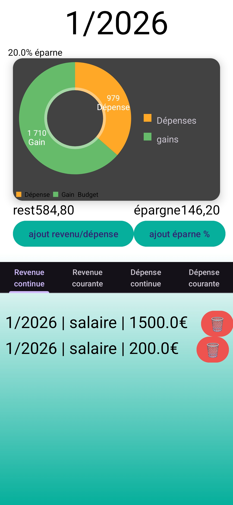
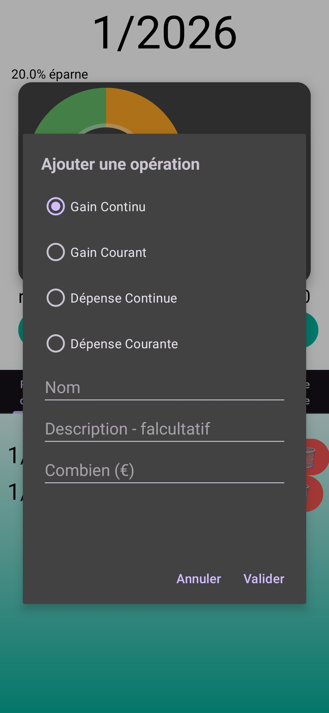
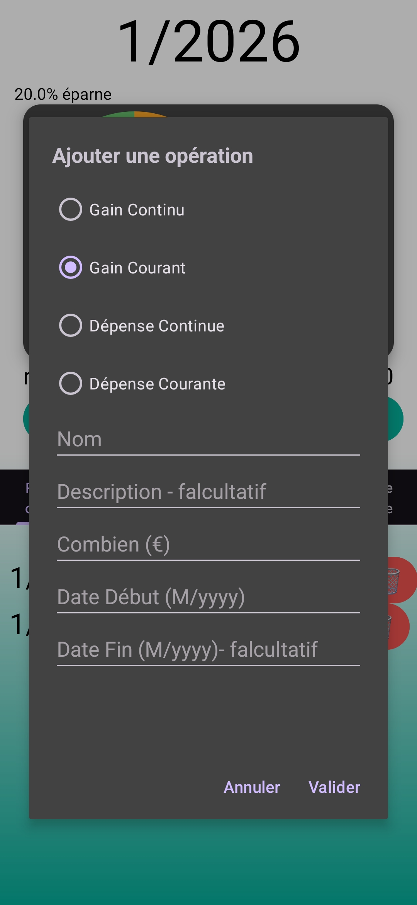
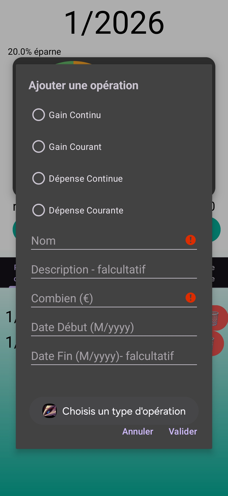
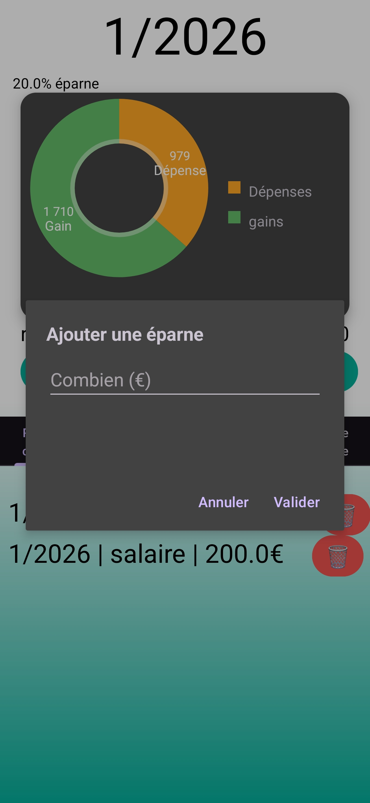

# Gestion des finances

Une application Android qui permet de vérifier combien il nous reste à la fin du mois et combien nous devons mettre de côté chaque mois.

# Modalités de téléchargement

Vous trouverez un fichier nommé APK Android, permettant de télécharger et d’installer l’application sur votre appareil Android.

J’ai également étudié la possibilité de rendre l’application disponible sur iPhone, mais ce n’est pas possible en l’état. Il faudrait soit utiliser Flutter, mais faudra payer les frais nécessaires pour publier l’application sur l’Apple Store.

# Visuel de l’application et son fonctionnement

Dans cette application, vous pouvez suivre votre budget grâce à un graphique en forme de donut qui affiche vos dépenses et vos gains.

Vous disposez également d’une gestion de l’épargne, qui vous indique combien vous devez mettre de côté pour le mois en cours. Cette valeur se met automatiquement à jour en fonction des gains et des dépenses que vous ajoutez.

Il y a aussi une section correspondant à ce qu’il vous reste, considérée comme un budget plaisir.

Nous pouvons également parcourir un tableau listant chaque dépense et chaque gain. Il est possible de les supprimer, par exemple si une donnée a été ajoutée par erreur ou si le salaire a changé.

Sous ce graphique, vous trouverez deux boutons :

le premier permet d’ajouter un gain ou une dépense (ponctuelle ou récurrente),

le second permet de mettre à jour le pourcentage d’épargne souhaité.

Chaque bouton ouvre une fenêtre contenant un formulaire à remplir.

Voici à quoi ressemble le bouton pour ajouter un gain ou une dépense :

 

S’il y a une erreur dans le formulaire, celui-ci ne pourra pas être validé et les erreurs seront indiquées à l’écran.

Le fonctionnement est similaire pour l’épargne, mais avec une seule donnée à renseigner :

Informations importantes

Toute modification ou lancement de l’application prend environ 3 secondes. Cela est dû au fait que le fichier Excel utilisé contient des calculs limités à 1000 cellules.
Si ce nombre est dépassé, les nouvelles données ne seront plus calculées.

Afin d’éviter l’ouverture du fichier Excel alors qu’il n’est pas encore fermé, un temps d’attente (sleep) de 1 seconde a été ajouté.

# Futures améliorations

- Dans le fichier Excel, une colonne permet déjà de calculer la quantité épargnée. Cela permettra plus tard d’afficher le montant total qui aurait dû être mis de côté depuis l’ajout du pourcentage d’épargne.

- Supprimer l’attente de 3 secondes au démarrage et mettre en place un affichage dynamique.

- Migrer l’application vers Flutter afin de proposer une version iPhone.
